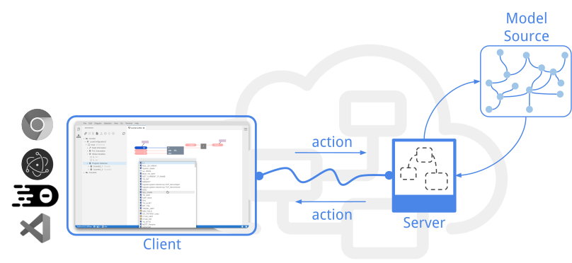
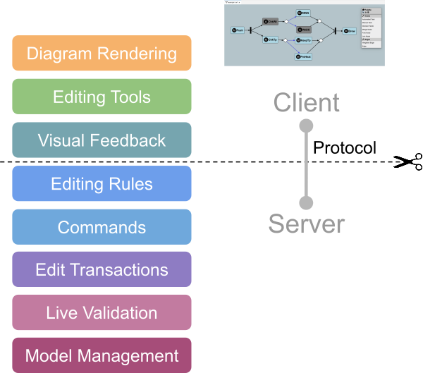
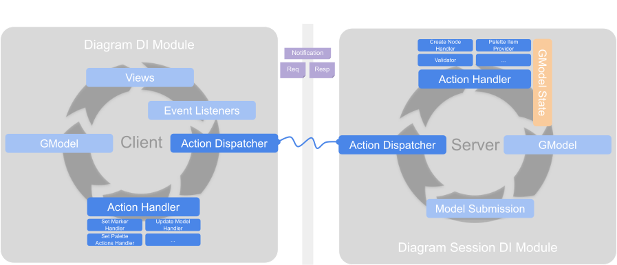
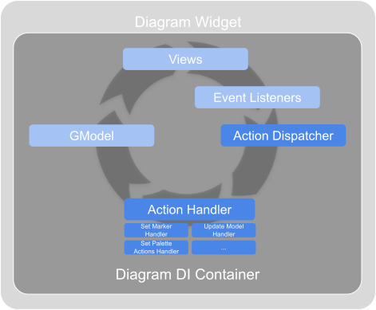

+++
fragment = "content"
weight = 100

title = "Overview & Architecture"

[sidebar]
  sticky = true
+++

### Overview
The *Graphical Language Server Platform* (GLSP) is a client-server framework for building web-based diagram editors.
It follows an architectural pattern similar to the hugely popular [Language Server Protocol](https://github.com/Microsoft/language-server-protocol), but applies it to graphical modeling and diagram editors.
With that, GLSP enables the development of modern, web-based diagram editors, whereas the heavy lifting, such as loading, interpreting, and editing diagrams according to the rules of the graphical diagram language, is encapsulated in the server.

A *GLSP Server* is a standalone backend process and provides the language-specific smarts and editing capabilities.
It communicates with a *GLSP Client* via action messages over JSON-RPC. Actions are plain JSON objects and describe the information needed to execute certain operations.
Both the *GLSP server* and *GLSP client* have dedicated action handlers that can process incoming action messages.

Each running diagram widget is considered to be a single *GLSP client*.
Each client is handled by exactly one *GLSP server*. A *GLSP server* can handle multiple *GLSP client*s, each within a dedicated client session.

The server is responsible for loading the model source, e.g. a file, EMF model, or database, into the model state and defines how to transform it into the graphical model.
The graphical model is a serializable description of the diagram that should be visualized.
It is the central communication artifact that is transferred to the client.

The *GLSP client* itself doesn’t need to know how the diagram has been generated from a model source or how to manipulate it.
Its main responsibility is to visualize the graphical model and to provide user interface elements for user interaction, such as editing tools.
Thus, the client interprets the graphical model received from the server and renders a diagram from it.
In addition, the *GLSP client* handles user interaction and provides editing tools to invoke manipulations of the diagram.
While such editing tools are applied by the user, it also shows visual feedback for guiding the user through editing operations.

  

Certain knowledge about the rules of the graphical language is required within client-side editing tools and visual feedback.
For instance, the client-side tools need to know whether the user is allowed to connect certain nodes with each other, whether those nodes can be resized or moved between container nodes, etc.
Therefore, the protocol between client and server provides dedicated action messages that allows to transfer this required context- and diagram-specific information between the server and the client.

Once an editing tool is applied in the client, the client sends a notification to the server, which then will perform the operation on the original model source, regenerates the graphical model and updates the client with the new version of the graphical model, which in turn will then update the rendered diagram based on the new graphical model.
  

### Action Protocol

The GLSP action protocol defines the message types that are exchanged between client and server.
The protocol is structured into so-called features.
A feature describes a specific diagram capability, e.g. element creation, diagram validation, etc.
Each feature is composed of a set of actions and/or operations.
An operation is a special subtype of an action and is used to describe actions that modify the underlying model source on the *GLSP server*.
Every action that modifies the model in any way has to be implemented as an operation.

A detailed description of the protocol is available in the [GLSP repository](https://github.com/eclipse-glsp/glsp/blob/master/PROTOCOL.md).
The action protocol is customizable and can even be extended with additional custom actions using the dependency injection approach (see [Dependency Injection]())
  

### Action Dispatching & Handling

  

Action messages are used for client-server communication.
In addition, they are also used for the internal event flow in both the *GLSP server* and the *GLSP client*.
The action dispatcher is the central component that manages all sent or received actions.
For each action type, one or more dedicated handlers can be registered.

When the dispatcher receives a new action for dispatching, it determines whether it should be dispatched to the internal action handlers only or submitted to the opposite component via JSON-RCP (server or client), based on the registered handlers on the server or the client.

The dispatcher distinguishes between notifications and request-response action pairs.
Notification actions are one-way actions transferred between client and server.
This means when the action dispatcher dispatches a notification it does not wait for a response and directly continues with dispatching the next incoming action.
Request actions are issued by the *GLSP client* and can be used to block client-side action dispatching until the server has sent a corresponding response action.
For more details on how to implement action handlers see [Action & Action Handler]().
  

### Dependency Injection

As diagram editors are by nature very specific to the respective diagram language, GLSP is designed with a strong focus on customization and extensibility.
To this end, both the client and the server are using an inversion of control pattern based on dependency injection (DI).
Every service and component that is part of a GLSP interaction is configured in a global DI container.
Adopters can simply modify this global DI container and bind additional services or even rebind existing services to customized versions of it.

#### GLSP Client

Each single diagram widget – that is each client – has its own isolated DI container.
All services used by the client, such as action handlers, views, mouse listeners, etc., are configured in this DI container.
On the client, GLSP adopts [inversify.js](https://inversify.io/) as dependency injection framework.
With Inversify, a DI container is constructed by loading a set of DI modules into a DI container.
Each DI module provides the bindings for a specific feature or concern.
Adopters can load new modules into the DI container.

  

#### GLSP Server

Similar to the GLSP client, also the server is configured via DI, including its service implementations, handlers, etc.
The main difference to the client is, however, that the server has to manage multiple diagram client sessions. Therefore the DI setup is composed of multiple DI containers:

  

- *Server DI Container*   
The server DI container is used to configure global components and services that are not related to a specific session diagram as well as components that are shared between all session containers.
- *Diagram Session DI Containers*  
Each client session has a dedicated DI container which holds the session-specific information as well as dedicated instances of handlers, states, etc.
Each client session container is associated with a single diagram language and is configured with the corresponding diagram module.

The Java-based GLSP server uses [Google Guice](https://github.com/google/guice) as a dependency injection framework.
With Google Guice, there is one main DI module that contains each binding in a dedicated method.
Adopters can extend this module and customize it by overriding dedicated binding methods.

The node-based GLSP server uses [inversify.js](https://inversify.io/) as dependency injection framework and is structured similarly to the GLSP client.
  

### Graphical Model

The graphical model is a serializable description of the diagram to be visualized on the client.
It is the central communication artifact between client and server.
The server creates the graphical model from an arbitrary model source and sends it to the client.
Thus, the client doesn’t need to know where it came from and how to manipulate it.
However, the client interprets the graphical model in order to render a visualization of the diagram described in the graphical model.

The graphical model is composed of nodes and edges.
Each element, whether it is a node or an edge, has a unique ID and a type.
The graphical model elements are organized in a tree, as defined by the parent-child relationship between elements.

The graphical model is typically composed of the following elements. However, these base classes can be extended by adopters, e.g. to be augmented with new custom element types and properties (see [Extending the Graphical Model]()).

- **GModelRoot**: Each graphical model must have exactly one root
  - **GShapeElement**: A graphical element is represented by a shape with visual bounds (position and size).
  Note that such elements can be nested based on their parent-child relationship.
  There are a the following concrete sub-types of shapes:
    - **GNode**: Representation of a logical diagram node
    - **GPort**: Ports are typically children of nodes and serve as connection points for edges
    - **GLabel**: Representation of a text label
    - **GCompartment**: A generic container element used for element grouping
  - **GEdge**: A diagram edge that connects a source element and a target element (typically nodes or ports).
  

#### SModel: Graphical model on client side

The default GLSP client uses [Sprotty](https://github.com/eclipse/sprotty/), an SVG-based diagramming framework, to render diagrams.
Sprotty uses a model to represent a diagram too -- the so-called SModel.
The graphical model of GLSP is based on the SModel and, thus, can be seen as a compatible extension of the Sprotty model.

As a naming convention, GLSP uses the S-prefix for model elements on the client to conform to the naming of the Sprotty model.
Thus, a node of the graphical model on the GLSP client is called SNode, whereas it is called GNode on the server, the same is true for SEdge/GEdge, etc.
Semantically, those elements, however, are equivalent and are exchanged transparently between the server and the client via JSON-RPC.
  

#### GModel: Graphical model on server side

The Java-based GLSP server uses the [Eclipse Modeling Framework (EMF)](https://www.eclipse.org/modeling/emf/) to represent and manage the graphical model internally.
Note that this is just an internal way of representing the GModel at runtime but doesn’t mean that adopters need to represent their original source models with EMF too.
The GLSP server uses EMF in order to reuse its model management and editing capabilities, its command stack and command-based editing.
Therefore, the graphical model is described as an Ecore model and the corresponding Java classes are automatically generated from this model.
Using GSON, the GModel is then serialized and deserialized to JSON before it is sent via JSON-RPC to the client.

The node-based GLSP server uses the same representation of the GModel as the client, since both are based on ES6.
  

### Platform Integrations

GLSP-based editors can be integrated into any web application frame.
To ease the platform integration for adopters, however, dedicated glue code frameworks are provided for

- Creating an extension to provide a [GLSP editor for Eclipse Theia](https://github.com/eclipse-glsp/glsp-theia-integration)
- Creating an extension to provide a [GLSP editor for VSCode](https://github.com/eclipse-glsp/glsp-vscode-integration)
- Creating a plugin to prove a [GLSP editor for the Eclipse IDE](https://github.com/eclipse-glsp/glsp-eclipse-integration)
- Creating a standalone GLSP web editor based on plain javascript

In general it is recommended to keep the GLSP diagram implementation separated from the platform integration code by splitting them into separate packages.
With that, the core GLSP editor can be easily reused and integrated into another platform.

As an example, the GLSP Workflow example provides the GLSP diagram implementation in the `@eclipse-glsp/workflow-glsp` package.
All platform specific integration examples import this package and provide a small integration package containing the platform-specific glue code on top.
