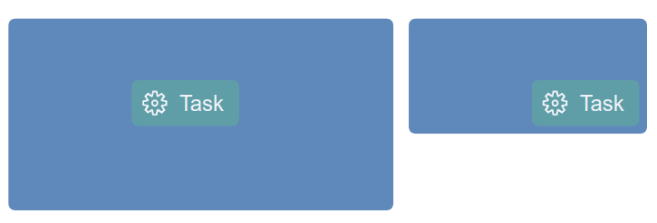

+++
fragment = "content"
weight = 100

title = "Client-side Layouting"

[sidebar]
  sticky = true
+++

We distinguish between micro and macro layout.
Usually, the server is responsible for the macro layout, that is the arrangement of the main model elements (i.e. nodes and edges).
This layout is defined already in the graphical model by means of coordinates.
In turn, the client is responsible for the micro layout, that is the positioning and size computation of elements within a container element such as nodes.
The client side (i.e. micro) layout can be configured in the graphical model, but will be applied on the client during the rendering phase.
</br>

### Layout Container

Graphical elements that support client-side layouting of contained elements offer a `layout` property which defines the type of layouter that should be used.
In addition, the behavior of the layouter can be configured with a set of `layout options`.

For an example let’s have a look at the following `GNode`:

<details open><summary> Java GLSP Server</summary>

```java
new GNodeBuilder()
   .layout(GConstants.Layout.VBOX)
   .layoutOptions(new GLayoutOptions()
      .hAlign(GConstants.HAlign.Center))
   .add(new GLabelBuilder()
      .text("label1")
      .build())
   .add(new GLabelBuilder()
      .text("label2")
      .build())
   .build();
```

</details>
<details ><summary> Node GLSP Server</summary>

```ts
GNode.builder()
  .layout("vbox")
  .addLayoutOption("hAlign", "center")
  .add(GLabel.builder().text("label1").build())
  .add(GLabel.builder().text("label2").build())
  .build();
```

</details>
</br>

This node contains two label elements that should be layouted vertically (from top to bottom) using the `vbox` layouter.
In addition, we specify options for that layouter by defining that the children should be centered horizontally.

#### Layout Options

To adapt the chosen Layout (for more details please see [below](#default-layouters)), the default Layout options [AbstractLayoutOptions](https://github.com/eclipse/sprotty/blob/master/packages/sprotty/src/features/bounds/layout-options.ts) allow to configure:

- `resizeContainer: boolean`</br>
  Indicates, if the container is resizable depending on its children (e.g. `true` for `hbox` layout)
- `paddingTop: number`</br>
  Sets the height of the padding area on the top of an element to be positioned in pixel.
- `paddingBottom: number`</br>
  Sets the height of the padding area on the bottom of an element to be positioned in pixel.
- `paddingLeft: number`</br>
  Sets the height of the padding area to the left of an element to be positioned in pixel.
- `paddingRight: number`</br>
  Sets the height of the padding area to the right of an element to be positioned in pixel.
- `paddingFactor: number`</br>
  Defines the multiplication factor for an element's size, which is then added as padding space around this element.
  E.g. For the `stack` layout `1` does not add additional padding to the element, `2` doubles the padding area around the element by its size.
- `minWidth: number`</br>
  Defines the minimum width of an element to be positioned.
- `minHeight: number`</br>
  Defines the minimum height of an element to be positioned.

<details open><summary>Usage Java GLSP Server</summary>

To use the Layout options on the GLSP Java Server, there are several utility classes for option keys and values, for example:

- Edge label placement `GConstants.EdgeSide`: `LEFT` | `RIGHT` | `TOP` | `BOTTOM` | `ON`
- Horizontal alignment `GConstants.HAlign`: `LEFT` | `CENTER` | `RIGHT`

For more details, please see [`GLayoutOptions`](https://github.com/eclipse-glsp/glsp-server/blob/master/plugins/org.eclipse.glsp.graph/src/org/eclipse/glsp/graph/builder/impl/GLayoutOptions.java)
and [`GConstants`](https://github.com/eclipse-glsp/glsp-server/blob/master/plugins/org.eclipse.glsp.graph/src/org/eclipse/glsp/graph/util/GConstants.java).

</details>

<details><summary>Usage Node GLSP Server</summary>

To use the Layout options on the GLSP Node Server, the support via utility classes for option keys and values is currently very limited, e.g. only the [EdgeSide](https://github.com/eclipse-glsp/glsp-server-node/blob/main/packages/graph/src/gedge-layoutable.ts) type is available.
Therefore please use the dedicated string values in the meantime, e.g. `"hAlign"` `"center"` and so on.

</details>

</br>

#### Default GLSP Layouters

In general, layouters can be applied to elements that are compartments, in order to layout the containers based on the sizes of their children.

There are three built-in layout types that can be used: `hbox`, `vbox` and `freeform`.

##### `hbox` Layout

The [`HBoxLayouterExt`](https://github.com/eclipse-glsp/glsp-client/blob/master/packages/client/src/features/bounds/hbox-layout.ts) layouts children of a container in a horizontal (left to right) direction.

This layouter provides additional layout options via `HBoxLayoutOptionsExt`:

- `hGap`: number</br>
  Defines a horizontal gap between elements in the same container in pixel.
- `vAlign`: VAlignment = 'top' | 'center' | 'bottom'</br>
  Defines the vertical alignment of the element to be positioned.
- `hGrab`: boolean</br>
  Indicates whether the remaining horizontal size can be grabbed by its children.
- `vGrab`: boolean</br>
  Indicates whether the remaining vertical size can be grabbed by its children.
- `prefWidth`: number | null</br>
  Defines the preferred width of the container element, which will be assigned, if there is no manually specified width and the sizes of its children aren't requiring a larger width to fit into the container.
- `prefHeight`: number | null</br>
  Defines the preferred height of the container element, which will be assigned, if there is no manually specified height and the sizes of its children aren't requiring a larger height to fit into the container.

According to the layout options, the children of the container are layouted and as concluding step, the final bounds of the container are computed based on the sum of this children bounds.

###### `hbox` Layout Example

This example creates a compartment of the default type `DefaultTypes.COMPARTMENT` using the `hbox` layout.
It adds two children, one icon compartment (with custom type `"icon"`) and one label.
The layout options define a horizontal gap of `15` pixel between the children of the compartment.

<details open><summary> Java GLSP Server</summary>

```java
   new GCompartmentBuilder()
         .type(DefaultTypes.COMPARTMENT)
         .layout(GConstants.Layout.HBOX)
         .layoutOptions(new GLayoutOptions().hGap(15))
         .add(new GCompartmentBuilder()
            .type("icon")
            .build())
         .add(new GLabelBuilder()
            .text("label")
            .build())
         .build();
   .build();
```

</details>

<details ><summary> Node GLSP Server</summary>

```ts
GCompartment.builder()
  .type("comp")
  .layout("hbox")
  .addLayoutOption("hGap", 15)
  .add(GCompartment.builder().type("icon").build())
  .add(GLabel.builder().text("label").build())
  .build();
```

</details>

</br>

On the client side, we need to configure (besides the default elements `GCompartment` and `GLabel`) a custom `Icon` element and a `IconView` like this: `configureModelElement(context, 'icon', Icon, IconView)`.
The [`Icon` element definition](https://github.com/eclipse-glsp/glsp-client/blob/master/examples/workflow-glsp/src/model.ts) and the [`IconView` definition](https://github.com/eclipse-glsp/glsp-client/blob/master/examples/workflow-glsp/src/workflow-views.tsx) are taken from the workflow example.

The resulting element with the obvious horizontal gap between the child elements is shown in the following image:

<p align="center">
    
</p>
<p  align="center">
    <em>Using no `hGap` layout option (left) or `hGap` layout option with 15 pixel (right)</em>
</p>

</br></br>

##### `vbox` Layout</br>

The [`VBoxLayouterExt`](https://github.com/eclipse-glsp/glsp-client/blob/master/packages/client/src/features/bounds/vbox-layout.ts) layouts children of a container in a vertical (top to bottom) direction.

This layouter provides additional layout options via `VBoxLayoutOptionsExt`:

- `vGap`: number</br>
  Defines a vertical gap between elements in the same container in pixel.
- `hAlign`: HAlignment = 'left' | 'center' | 'right'</br>
  Defines the horizontal alignment of the element to be positioned.
- `hGrab`: boolean</br>
  Indicates whether the remaining horizontal size can be grabbed by its children.
- `vGrab`: boolean</br>
  Indicates whether the remaining vertical size can be grabbed by its children.
- `prefWidth`: number | null</br>
  Defines the preferred width of the container element, which will be assigned, if there is no manually specified width and the sizes of its children aren't requiring a larger width to fit into the container.
- `prefHeight`: number | null</br>
  Defines the preferred height of the container element, which will be assigned, if there is no manually specified height and the sizes of its children aren't requiring a larger height to fit into the container.

According to the layout options, the children of the container are layouted and as concluding step, the final bounds of the container are computed based on the sum of this children bounds.

###### `vbox` Layout Example

This example creates a compartment of the default type `DefaultTypes.COMPARTMENT` using the `vbox` layout.
It adds two children labels, which are positioned vertically from top to bottom and are centered horizontally.

<details open><summary> Java GLSP Server</summary>

```java
   new GCompartmentBuilder()
         .type(DefaultTypes.COMPARTMENT)
         .layout(GConstants.Layout.VBOX)
         .layoutOptions(new GLayoutOptions().hAlign(GConstants.HAlign.CENTER))
         .add(new GCompartmentBuilder()
            .type("icon")
            .build())
         .add(new GLabelBuilder()
            .text("Label")
            .build())
         .build();
   .build();
```

</details>

<details ><summary> Node GLSP Server</summary>

```ts
GCompartment.builder()
  .type("comp")
  .layout("vbox")
  .addLayoutOption("hAlign", "center")
  .add(GCompartment.builder().type("icon").build())
  .add(GLabel.builder().text("Label").build())
  .build();
```

</details>

</br>

On the client side, we use again the `Icon` element definition and `IconView`, please see section [`hbox` Layout Example](#hbox-layout-example).

The resulting element positions its children vertically from top to bottom and aligns each element horizontally, this is shown in the following image:

<p align="center">
    
</p>
<p  align="center">
    <em>Center children horizontally (left image) or align children to the left (right image)</em>
</p>

</br></br>

##### `freeform` Layout</br>

The [`FreeFormLayouter`](https://github.com/eclipse-glsp/glsp-client/blob/master/packages/client/src/features/bounds/freeform-layout.ts) positions the children of a container according to their explicit, parent-relative `x/y` coordinates inside the parent container.
This layouter uses the default [Layout Options](#layout-options) and provides suitable default values (e.g. `resizeContainer: true`).

Again here, the children of the container are positioned according to their explicit positions inside the container and as concluding step, the final bounds of the container are computed based on the required bounds of its children.

###### `freeform` Layout Example

This example creates a compartment of the custom type `"comp:structure"` using the `freeform` layout.
It adds one child node, at the relative position `(75, 35)` of the parent container.
The parent container defines its preferred size of `250 x 125`.

<details open><summary> Java GLSP Server</summary>

```java
  GDimension containerPrefSize = GraphUtil.dimension(250 /*width*/, 125 /*height*/);
  GPoint childPosition = GraphUtil.point(75 /*x*/, 35 /*y*/);

  Map<String, Object> layoutOptions = new HashMap<>();
  layoutOptions.put(H_GRAB, true);
  layoutOptions.put(V_GRAB, true);
  layoutOptions.put(GLayoutOptions.KEY_PREF_WIDTH, containerPrefSize.getWidth());
  layoutOptions.put(GLayoutOptions.KEY_PREF_HEIGHT, containerPrefSize.getHeight());
  new GCompartmentBuilder()
    .type("comp:structure")
    .layout(GConstants.Layout.FREEFORM)
    .layoutOptions(layoutOptions)
    .add(
      new GNodeBuilder(DefaultTypes.NODE)
        .position(childPosition)
        .build()
    )
    .build();
```

</details>

<details ><summary> Node GLSP Server</summary>

```ts
const containerPrefSize = { width: 250, height: 125 };
const childPosition = { x: 75, y: 35 };

const layoutOptions = {
  ["hGrab"]: true,
  ["vGrab"]: true,
  ["prefWidth"]: containerPrefSize.width,
  ["prefHeight"]: containerPrefSize.height,
};
GCompartment.builder()
  .type("comp:structure")
  .layout("freeform")
  .addLayoutOptions(layoutOptions)
  .add(GNode.builder().type("node").position(childPosition).build())
  .build();
```

</details>

</br>

On the client side, configure the `"comp:structure"` compartment as `configureModelElement(context, 'struct', GCompartment, StructureCompartmentView)`.

The resulting compartment element positions its child at the desired position.
The compartment defines its preferred size, which is used if the children do not enlarge the container. If the preferred size is omitted, the container's size depends on its children.

<p align="center">
    
</p>
<p  align="center">
    <em>Container with preferred size (left image) or without preferred size (right image)</em>
</p>

</br></br>

#### Custom Layouter

Additional custom layouters can be contributed by creating a layouter class that extends the `AbstractLayouter` and optionally provide custom options that extend the `AbstractLayoutOptions`.

In the following example we show a simple custom layouter that extends the `VBoxLayouterExt` and provides a custom layout option,
which increases the widths and heights of all children by a specified value, the default value is `50` pixel.

<details open><summary>GLSP Client</summary>

```ts
export interface MyCustomLayoutOptions extends VBoxLayoutOptionsExt {
  enlargeSizeBy: number;
}

@injectable()
export class MyCustomLayouter extends VBoxLayouterExt {
  static override KIND = "myCustomLayout";

  protected override getChildrenSize(
    container: GParentElement & LayoutContainer,
    containerOptions: MyCustomLayoutOptions,
    layouter: StatefulLayouter
  ): Dimension {
    const result = super.getChildrenSize(container, containerOptions, layouter);
    return {
      width: result.width + containerOptions.enlargeSizeBy,
      height: result.height + containerOptions.enlargeSizeBy,
    };
  }

  protected override getDefaultLayoutOptions(): MyCustomLayoutOptions {
    return {
      enlargeSizeBy: 50,
      ...super.getDefaultLayoutOptions(),
    };
  }

  protected override spread(
    a: MyCustomLayoutOptions,
    b: MyCustomLayoutOptions
  ): MyCustomLayoutOptions {
    return { ...a, ...b };
  }
}
```

</details>

Then the new custom layout needs to bound in the diagram module (`di.config.ts`):

<details open><summary>GLSP Client</summary>

```ts
const myDiagramModule = new ContainerModule((bind, unbind, isBound, rebind) => {
   rebind(VBoxLayouter).to(MyCustomLayouter);
}
```

</details>

Custom layouter, which don't overwrite existing ones, should extend the `AbstractLayout` and can be registered for a certain layouter key,
e.g. `MyCustomLayouter.KIND`, that is used in the `layout` property of compartments as follows:

<details open><summary>GLSP Client</summary>

```ts
const myDiagramModule = new ContainerModule((bind, unbind, isBound, rebind) => {
   configureLayout({ bind, isBound }, MyCustomLayouter.KIND, MyCustomLayouter);
}
```

</details>

With that, the custom layouter is ready to be used by compartments in the graphical model:

<details open><summary> Java GLSP Server</summary>

```java
   new GCompartmentBuilder()
         .type(DefaultTypes.COMPARTMENT)
         .layout("myCustomLayout")
         .layoutOptions(Map.of("enlargeSizeBy", 15))
         .add(new GLabelBuilder()
            .text("label")
            .build())
         .build();
   .build();
```

</details>

<details ><summary> Node GLSP Server</summary>

```ts
GCompartment.builder()
  .builder()
  .layout("myCustomLayout")
  .addLayoutOption("enlargeSizeBy", 15)
  .add(GLabel.builder().text("label").build())
  .build();
```

</details>

</details>
</br>

### Edge Layout

Graphical elements that are typically rendered in combination with an edge such as labels have an `edgeLayout` property.
This can be used to describe how the element should be aligned with the edge.

For example let's have a look at the following `GLabel`:

<details open><summary> Java GLSP Server</summary>

```java
new GLabelBuilder()
   .edgePlacement(new GEdgePlacementBuilder()
      .side(GConstants.EdgeSide.TOP)
      .position(0.5)
      .build())
   .add(new GLabelBuilder().text("MyLabel").build())
   .build();
```

</details>
<details ><summary> Node GLSP Server</summary>

```ts
GLabel.builder()
  .edgePlacement({ side: "top", position: 0.5, rotate: false, offset: 0 })
  .add(new GLabelBuilder(GLabel).text("MyLabel").build())
  .build();
```

</details>
</br>

The label above specifies the property `edgePlacement`.
If this label is added as a child of an edge, it will be placed above the edge.
The position is defined with 0.5 (i.e. 50 percent of the edge length) which means the label should be placed in the center of the edge.
After the edge routes have been rendered the client will query all active edge placements and adjust the label position accordingly.
