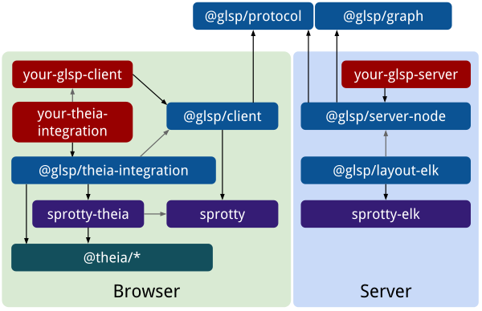
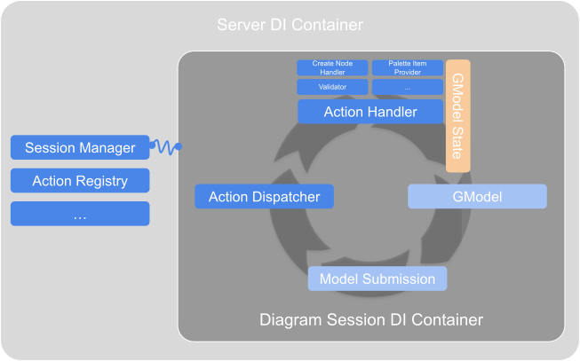

+++
fragment = "content"
weight = 100

title = "Servers, Tool Platform and Source Model Integrations"

[sidebar]
  sticky = true
+++

As mentioned in the [getting started]() guide, GLSP is architected to be very flexible and provides several options.
On this page, we give an overview of the dedicated integration components and point to the respective source code.

* 🖥️ [**Server**](#server-frameworks) 
   GLSP servers can be written either in Java or with Typescript based on nodejs.
* 🗂️ [**Source Model**](#source-model-integrations) 
   You can use any format or framework for managing your source model.
   For the most common choices, GLSP provides dedicated base modules, such as for [EMF](https://www.eclipse.org/modeling/emf), [emf.cloud](https://www.eclipse.org/emfcloud), or GModel-JSON, which contains the graphical model directly.
* 🖼️ [**Tool Platform**](#platform-integrations) 
   Diagram editors can used in multiple tool platforms or used in plain web applications or in an Electron app.
   GLSP provides dedicated integration components for seamlessly deploying a GLSP editor inside of [Eclipse Theia](https://www.theia-ide.org), [VS Code](https://code.visualstudio.com), or [Eclipse RCP](https://www.eclipse.org/ide).

Due to GLSP's architecture, you can even change any of those options above later on, without impacting other parts of your implementation, or support multiple variants, e.g. VS Code and Eclipse RCP, while sharing almost all of your server and client code.

Need help deciding?

---

There are many options to choose from.
In the following, we list a few hints to help you decide.
Please note that especially the tool platform integration doesn't have to be an ultimate decision.
Many adopters start deploying for one tool platform, e.g. Eclipse Theia, but add support for VS Code later and offer both options in parallel.

---

#### 🖥️ Server

Whether to use Java or Typescript is a matter of taste.
However, there also are objective considerations.

* If you aim at providing a VS Code extension or Theia plugin, shipping a node-based GLSP server is easier, because you don't need to worry whether your users have a JVM installed. They'll have a node runtime already, otherwise they couldn't run VS Code or Theia. If you have more control over your users runtime, e.g. because the editor will run in a container in the cloud anyway, this is less of a concern.
* Using one language (Typescript) for your GLSP server and client leads to a more homogeneous developer experience than having to work with two languages (Java and Typescript).
* If you already have an editor implementation in Java, e.g. based on GMF, etc., or an EMF metamodel, building a Java-based server opens lots of opportunities for reusing your existing business logic in the GLSP server.
* If you want to work with EMF source models directly from your GLSP server, e.g. because you want to benefit from its command stack implementation, change notification support, etc., using Java on the GLSP server is clearly better.

#### 🗂️ Source Model

The choice of a framework to manage your source model mostly depends on two things:

1. Which language do you choose for your GLSP server? This may already remove options, e.g. EMF in a node server, unless you externalize the model management into an own separate component, such as an emf.cloud model server.
2. How do you process those source models later on, e.g. for code generation, interpreting it at runtime, etc. and what in what language those components that process your source model are developed with?

Besides, there are a few more considerations.

* Usually you want to provide undo/redo support. If you use a custom serialization and format, you'll have to implement that yourself. Or are there frameworks available that will do that for you? For Java, EMF is a great choice here.
* You may want to consider using a database instead of a file. This will externalize much of the model and transaction management for you. However, databases have the disadvantage that they shouldn't be checked into a git repository. So you opt out of a completely file-based approach with that choice.
* In many use cases, it is advisable to separate the graphical information (such as coordinates) from the "semantic" information of your model. This way your semantic model will be more concise for later processing. It'll put a slight overhead during editing on top, as you'll need to manage two resources. For EMF, GLSP provides a very simple notation model to capture the graphical information.

More information on the integration components is given in the section on [source model integrations](#source-model-integrations).

#### 🖼️ Tool Platform

The decision for a tool platform has many aspects, such as are you providing a product or a plugin for a generic tool, such as VS Code, are your users already using a certain tool platform, etc.?
However, the integration layer of GLSP editors for certain tools is rather thin and it is not much work to provide multiple options here in parallel.
So choose what's best for you now, you can easily change or add a tool platform support later.

More information on the integration components is given in the section on [platform integrations](#platform-integrations).

---

 

### Package Architecture

<!-- TODO write -->

Depending on your choice of tool platform integration and server framework, a different selection of packages needs to be used.
The project templates linked in the [getting started guide]() provide the initial setup of the package architecture for the respective combination of components.
However, all of them will have a diagram-specific client package that depends on [@glsp/client](https://github.com/eclipse-glsp/glsp-client/tree/master/packages/client) and a diagram-specific server package that either depends on the [node-based GLSP server framework](https://github.com/eclipse-glsp/glsp-server-node/tree/main/packages/server) or the [Java-based GLSP server framework](https://github.com/eclipse-glsp/glsp-server/tree/master/plugins/org.eclipse.glsp.server).

Irrespectively of the used tool platform integration, server framework or source model integration, your custom `glsp-client` is always the same and can be reused for all scenarios.
Your server implementation is also independent of the respective platform integration and reusable for multiple platforms.
Depending on the source model framework, the server may add additional dependencies (e.g. to use the [EMF.cloud model server client](https://github.com/eclipse-emfcloud/emfcloud-modelserver/tree/master/bundles/org.eclipse.emfcloud.modelserver.client)).

As an example, the following figure shows the package architecture for a Theia-based GLSP editor with a node-based server.

 
<b>Package overview for node-based server and Theia integration</b>

The package `your-glsp-client` represents your custom client package and `your-glsp-server` depicts your custom GLSP server package.
They contain the diagram-specific implementations for your diagram editor and modeling language.

Please note how the `your-glsp-client` builds upon the [@glsp/client](https://github.com/eclipse-glsp/glsp-client/tree/master/packages/client) and the package `your-theia-integration` just integrates this as an editor based on [@glsp/theia-integration](https://github.com/eclipse-glsp/glsp-theia-integration/tree/master/packages/theia-integration) into the Theia tool platform.
Your GLSP client and your Theia integration have an indirect dependency to [Eclipse Sprotty](https://github.com/eclipse/sprotty) and its [Theia glue code](https://github.com/eclipse/sprotty-theia).
Both the client and the server share a common package [@glsp/protocol](https://github.com/eclipse-glsp/glsp-client/tree/master/packages/protocol) that defines the action types.

### Server Frameworks

GLSP servers can be written in any language, as they run in a separate process and communicate via JSON-RCP with the client.
To make it easier to develop GLSP servers, however, GLSP provides two server frameworks:

* [GLSP server framework for Java](https://github.com/eclipse-glsp/glsp-server)
* [GLSP server framework for Node](https://github.com/eclipse-glsp/glsp-server-node)

Even though they are built with different runtimes and languages, they are structurally very similar.
Both use dependency injection (DI) for hooking up your diagram-specific providers, services, and handlers or for replacing default implementation with customized implementations.

The Java-based GLSP server uses [Google Guice](https://github.com/google/guice) as a dependency injection framework.
With Google Guice, there is one main DI module that contains each binding in a dedicated method.
Adopters can extend this module and customize it by overriding dedicated binding methods.
The node-based GLSP server uses [inversify.js](https://inversify.io/) as dependency injection framework.

For both servers, GLSP provides dedicated abstract base classes named `DiagramModule`, which are intended to be extended in order to implement a concrete diagram server.
The idea of those abstract base classes is that the abstract methods they contain MUST be implemented in order to show a diagram, e.g. the [source model storage]() and the [graphical model factory](), and additional methods MAY be overwritten to add functionalities, such as certain [editing operations]() or [model validation](), or to customize default behavior.
There are also [pre-configured diagram modules](#source-model-integrations) for certain source models, described below, e.g. for EMF or EMF.cloud, which already bind relevant implementations.

The remainder of this documentation shows, whenever applicable, a code example for both servers.
Also there are project templates for both servers, as listed in the [getting started guide](), as well as an example server for the common "workflow diagram", in each of the server repositories, linked above.

#### Server DI Container vs Diagram Session DI Container

It is worth noting, that GLSP servers distinguish between two DI containers:

* *Server DI Container*  
The server DI container is used to configure global components and services that are not related to a specific session diagram as well as components that are shared between all session containers.
* *Diagram Session DI Containers*  
Each client session has a dedicated DI container which holds the session-specific information as well as dedicated instances of handlers, states, etc.
Each client session container is associated with a single diagram language and is configured with the corresponding diagram module.

### Source Model Integrations

GLSP works with any source model format or framework for managing your source model, as the implementation for loading source models and translating them into diagrams needs to be provided by the developer of the diagram editor.
However, there are recurring popular choices, for which GLSP provides base modules with default implementations for a specific source model framework.

* [Integration for EMF models](https://github.com/eclipse-glsp/glsp-server/tree/master/plugins/org.eclipse.glsp.server.emf)
* [Integration for EMF models with a separate notation model](https://github.com/eclipse-glsp/glsp-server/tree/master/plugins/org.eclipse.glsp.server.emf)
* [Integration for EMF.cloud model server](https://github.com/eclipse-emfcloud/modelserver-glsp-integration)
* Abstract base diagram module for storing and modifying GModels as JSON files directly: [Java](https://github.com/eclipse-glsp/glsp-server/blob/master/plugins/org.eclipse.glsp.server/src/org/eclipse/glsp/server/gmodel/GModelDiagramModule.java) or [node](https://github.com/eclipse-glsp/glsp-server-node/blob/main/packages/server/src/common/gmodel/gmodel-diagram-module.ts)

### Platform Integrations

GLSP-based editors can be integrated into any web application frame.
To ease the platform integration for adopters, however, dedicated glue code frameworks are provided for

* Creating an extension to provide a [GLSP editor for Eclipse Theia](https://github.com/eclipse-glsp/glsp-theia-integration)
* Creating an extension to provide a [GLSP editor for VS Code](https://github.com/eclipse-glsp/glsp-vscode-integration)
* Creating a plugin to prove a [GLSP editor for the Eclipse IDE](https://github.com/eclipse-glsp/glsp-eclipse-integration)
* Creating a standalone GLSP web editor based on plain javascript

In general it is recommended to keep the GLSP diagram implementation separated from the platform integration code by splitting them into separate packages.
With that, the core GLSP editor can be easily reused and integrated into another platform.

As an example, the GLSP Workflow example provides the GLSP diagram implementation in the `@eclipse-glsp/workflow-glsp` package.
All platform-specific integration examples import this package and provide a small integration package containing the platform-specific glue code on top.
