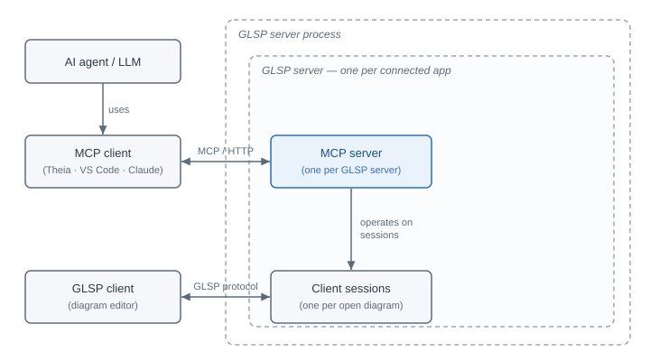

+++
fragment = "content"
weight = 100

title = "Model Context Protocol (MCP)"

[sidebar]
  sticky = true
+++

The [Model Context Protocol (MCP)](https://modelcontextprotocol.io/) is an open standard that lets AI agents and language models interact with external systems through a uniform interface.
A GLSP server can optionally act as an MCP server, so that AI clients such as an IDE chat assistant can inspect and edit diagrams through the same interface they use for any other MCP integration.

In practice this lets an assistant answer questions about a diagram, suggest improvements, create or adjust elements from a natural-language request, or check the model for problems, all while the diagram stays open in the GLSP editor.

<small>*Experimental: MCP support is under active development and its configuration may still change. It is currently available for the [Node GLSP server](https://github.com/eclipse-glsp/glsp-server-node) only, with [Java server support](https://github.com/eclipse-glsp/glsp/issues/1672) planned.*</small>

### What it provides

A GLSP MCP server surfaces the active diagrams through the three MCP capability kinds:

* 🛠️ **Tools** to inspect, query, create, modify, delete, validate, and navigate diagram elements.
* 📦 **Resources** that expose read-only, URI-addressable views of a diagram, such as a rendered image.
* 💬 **Prompts** that frame common multi-step agent tasks against the diagram.

Each MCP client connects over the standard MCP streamable HTTP transport and gets its own session, guided by a built-in modeling agent persona toward safe use of the tools.

### Enabling MCP

MCP is opt-in and off by default.
An MCP-aware GLSP client enables it by adding an `mcpServer` configuration to the [initialize request]() it already sends.
The standalone workflow example, for instance, passes it through the diagram loader:

```ts
diagramLoader.load<McpInitializeParameters>({
    // opt in by adding mcpServer (all fields optional)
    initializeParameters: { mcpServer: { name: 'glsp-workflow', port: 64577 } }
});
```

An empty `mcpServer: {}` enables MCP with all defaults.
Its options such as the port, route, and name are documented in the [adopter guide](https://github.com/eclipse-glsp/glsp-server-node/blob/main/packages/server-mcp/README.md).

### Architecture

<p align="center">

<br/>
<b>High-level MCP architecture: the GLSP server starts an MCP server when a client opts in</b>
</p>

The MCP server runs inside each GLSP server, which is created per connecting application (in the common desktop setup, one per process).
One GLSP server therefore has one MCP server on one port, and all of that server's diagrams are reached through it.

The MCP server is not started eagerly.
The GLSP server spawns it the first time a client opts into MCP, and disposes it when the GLSP server shuts down.
The resolved URL is announced back to the client (and logged on the server's standard output), so the tool platform integration can register it with the MCP client.
A random free port is used by default, but adopters can pin a fixed port when an external MCP client needs a stable URL.

Besides this Node process model, the MCP server is portable: it can also run fully in the browser inside a Web Worker, so AI-assisted modeling works in pure web deployments of GLSP as well.

### Adapting it to your language

The built-in tools work on any GLSP model, but their default output is deliberately generic.
A few language-specific adaptations give noticeably better results:

* A custom **model serializer** controls how a diagram is presented to the model. The workflow example renders it as semantically ordered Markdown and drops redundant attributes, which improves comprehension and keeps the context small.
* A custom **label provider** and **element-types provider** tell the model how elements are labeled and which element types it may create, so the built-in create and modify tools work for your language.

The built-in write tools dispatch standard GLSP [operations](), so they reuse a diagram's existing operation handlers and an assistant's edits follow the same validation and undo or redo as a manual one.
Adopters therefore rarely need custom tools for editing, but they can add their own tools, resources, and prompts for language-specific actions.
A tool always returns a human-readable text result and may additionally return a structured payload, so different MCP clients can consume whichever form they support.

The workflow example demonstrates these provider overrides, and the [extension guide](https://github.com/eclipse-glsp/glsp-server-node/blob/main/packages/server-mcp/ARCHITECTURE.md) covers adding custom tools, resources, and prompts.

### Tool platform integration

How the announced MCP server URL reaches the AI client depends on the platform:

* **Eclipse Theia**: the [Theia MCP integration](https://github.com/eclipse-glsp/glsp-theia-integration/tree/master/packages/theia-mcp-integration) registers every GLSP server's MCP endpoint with Theia's AI MCP support automatically, with no extra wiring beyond installing it.
* **VS Code**: the [VS Code integration](https://github.com/eclipse-glsp/glsp-vscode-integration) provides an MCP server provider that adopters register in their extension and feed with the GLSP initialize result.
* **Standalone or external clients**: tools such as Claude Desktop or the MCP Inspector connect to the announced URL directly. Pin a fixed port and share it in your setup guide.

### Security

The shipped defaults assume a single trusted local process reaching the server over loopback, which is the typical desktop IDE setup.
The server binds to loopback only and performs the standard Host and Origin checks to defeat DNS rebinding, but it ships with **no authentication**.
If an adopter widens the bind beyond loopback without acknowledging the missing authentication, the server refuses to start. Doing so safely requires an external authenticating layer such as a reverse proxy.
The server is not hardened for hostile multi-tenant or public exposure.

### Further reading

* [server-mcp adopter guide](https://github.com/eclipse-glsp/glsp-server-node/blob/main/packages/server-mcp/README.md): the integration quickstart.
* [server-mcp architecture and extension guide](https://github.com/eclipse-glsp/glsp-server-node/blob/main/packages/server-mcp/ARCHITECTURE.md): architecture, security model, configuration options, and the extension cookbook.
* [MCP feature request (issue #1546)](https://github.com/eclipse-glsp/glsp/issues/1546): background and rationale.
