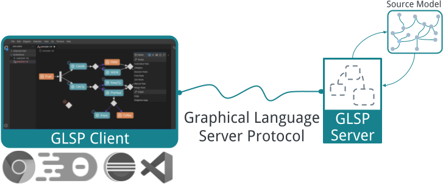

+++
fragment = "content"
weight = 100

title = "Overview & Architecture"

[sidebar]
  sticky = true
+++

The *Graphical Language Server Platform* (GLSP) is a client-server framework for building web-based diagram editors.
It follows an architectural pattern similar to the hugely popular [Language Server Protocol](https://github.com/Microsoft/language-server-protocol), but applies it to graphical modeling and diagram editors.
With that, GLSP enables the development of modern, web-based diagram editors, whereas the heavy lifting, such as loading, interpreting, and editing diagrams according to the rules of the graphical diagram language, is encapsulated in the server.
Consequently, diagram editors can easily be integrated with multiple tool platforms, such as VS Code, Eclipse Theia, Eclipse RCP, and in standalone or web apps.

A *GLSP Server* is a separate backend process and provides the language-specific smarts and editing capabilities.
It communicates with a *GLSP Client* over JSON-RPC with an [extensible action protocol](https://github.com/eclipse-glsp/glsp/blob/master/PROTOCOL.md).
Each diagram editor is considered to be a single *GLSP client*.
Each client is handled by exactly one *GLSP server*.
A server can handle multiple clients, each within a dedicated client session.

### How it works

The *GLSP server* is responsible for loading an arbitrary [source model](), e.g. a JSON file, EMF model, or database, and defines how to transform it into the graphical model.
The [graphical model]() is a serializable description of the diagram to be rendered on the client.
It is the central communication artifact that is transferred to the client.

The *GLSP client* receives the graphical model as input and [renders it]().
Additionally, the client requests information on editing operations that can be applied in the context of the graphical model.
Based on this information, the client can provide the editing tools for making changes to the diagram, such as moving elements, adding nodes or edges, changing labels, etc.

Once a user performs a change in the diagram, the client sends a notification to the server, which then applies the operation back to the source model, regenerates the graphical model and updates the client with the new version of the graphical model, which in turn will then update the rendered diagram based on the new graphical model.

### Customization and Extension

As diagram editors are by nature very specific to the respective diagram language, GLSP is designed with a strong focus on customizability and extensibility.
To this end, GLSP applies two principles:

1. **Dependency Injection** 
   Both the client and the server are using an inversion of control pattern based on dependency injection (DI) with [inversify.js](https://inversify.io/) and [Guice](https://github.com/google/guice).
   Every service and component is configured in a global DI container and can simply be extended or even replaced with a custom implementation.
   Adopters consequently have the same power for their diagram editors, as the framework authors.
2. **Slim abstractions and direct access to the underlying technologies** 
   Especially, when it comes to the look & feel of a diagram editor, it is crucial to have full control over the rendering and the UI.
   Therefore, GLSP gives full access and control over the underlying UI technologies, such as Eclipse Sprotty, SVG and CSS, editing tools, user interface controls (HTML), without abstraction layers where control matters.
   Avoiding abstraction layers also enables an excellent debugging experience.

➡️ Now it is time to [get started]()!
