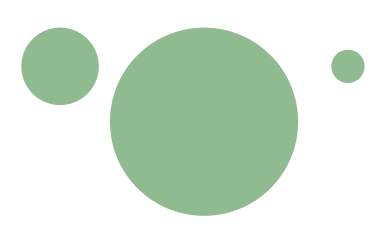
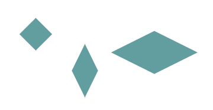
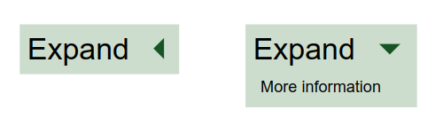
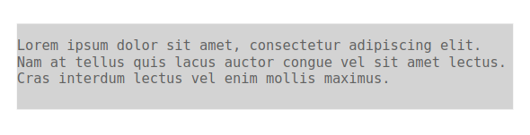
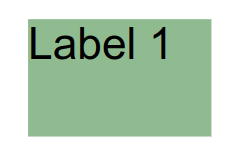
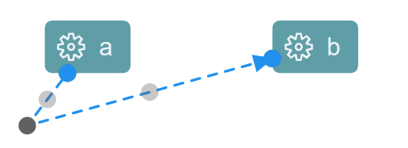
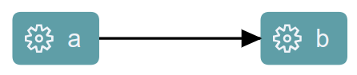
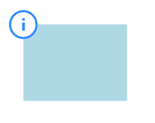
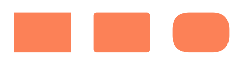

+++
fragment = "content"
weight = 100

title = "Graphical Model Rendering & Styling"

[sidebar]
  sticky = true
+++

### Rendering

The input of the diagram rendering on the client is the GModel that has been generated on the server from the source model (see [Graphical Model]()) and sent to the client via a [SetModelAction](https://github.com/eclipse-glsp/glsp/blob/master/PROTOCOL.md#242-setmodelaction) or [UpdateModelAction](https://github.com/eclipse-glsp/glsp/blob/master/PROTOCOL.md#243-updatemodelaction).
The client is then responsible for rendering the GModel.

In order to render the received graphical model, each graphical element type needs to be associated with a view on the client.
A view defines how a specific type of graphical element shall be transformed into a corresponding SVG representation.
The derived SVG elements are then rendered on the canvas of the diagram widget.

To define a new view, we have to create a class that implements the `IView` interface and register it for a specific type that is used in the graphical model.
As an example, let’s configure that the view named `SLabelView` is used for all elements with the type “label:custom”.
Therefore, we first need to create a dependency injection module, named `customDiagramModule` below, and configure the SLabelView for the graphical model element type “label:custom” using the `configureModelElement()` utility function:

```ts
const customDiagramModule = new ContainerModule(
  (bind, unbind, isBound, rebind) => {
    const context = { bind, unbind, isBound, rebind };
    configureModelElement(context, "label:custom", SLabel, SLabelView);
  }
);
```

The `configureModeElement()` function takes the inversify binding context, the graphical model type, its model class and its associated view as input. Under the hood this function sets up the necessary bindings so that the _GLSP client_ knows that

- Graphical model elements (received from the GLSP Server) with type ‘label:custom’ are deserialized to instances of `SLabel`
- Graphical model element with type ‘label:custom’ are rendered with the `SLabelView`

In order to be effective, we need to load the module `customDiagramModule` defined above in the diagram DI container, aka the root "di.config.ts" of your diagram implementation.
With that, every element of type “label:custom” will be rendered with the view implementation `SLabelView`.

Views themselves are typically implemented with [JSX](https://www.typescriptlang.org/docs/handbook/jsx.html), which simplifies the definition of SVG elements in Typescript. Therefore, the following generic imports are required in any module declaring a view to enable declaration of svg elements with JSX:

```ts
/** @jsx svg */
import { VNode } from "snabbdom";
import { RenderingContext, svg } from ‘@eclipse-glsp/client’;
```

In addition, make sure that the following options are set in the `tsconfig.json` file of your project:

```json
{
  "compilerOptions": {
    "jsx":"react",
    "reactNamespace":"JSX"
}
```

With that, we can implement a view as follows:

```tsx
@injectable()
export class SLabelView extends ShapeView {
  render(
    label: Readonly<SLabel>,
    context: RenderingContext
  ): VNode | undefined {
    if (!isEdgeLayoutable(label) && !this.isVisible(label, context)) {
      return undefined;
    }
    const vnode = <text class-sprotty-label={true}>{label.text}</text>;
    const subType = getSubType(label);
    if (subType) {
      setAttr(vnode, "class", subType);
    }
    return vnode;
  }
}
```

Every view has to implement the `render()` method.
The `render()` method takes the graphical model element as input and returns the corresponding SVG element as virtual DOM node.
The viewer queries all registered views and creates a new virtual DOM which is then used to patch the current DOM of the diagram widget.

Note that the `SLabelView` also checks whether the given element is visible and skips the SVG generation if the element is not visible in the diagram canvas.
This check is optional but it’s highly recommended to implement it in your custom views as it heavily improves the rendering performance.

</br></br>

### Default Views

The following sections give an overview of available default views in Sprotty and GLSP and how to configure them.
All of them are default model elements, which is already configured in the [`baseViewModule`](https://github.com/eclipse-glsp/glsp-client/blob/master/packages/client/src/views/base-view-module.ts),
but for the sake of completeness we list the configuration of the elements in the collapsible example code blocks.

#### Default Sprotty Views

The following views are provided by the base framework [Sprotty](https://github.com/eclipse/sprotty).

##### [CircularNodeView](https://github.com/eclipse/sprotty/blob/master/packages/sprotty/src/lib/svg-views.tsx)

A `CircularNodeView` creates a round shape with a radius computed from the shape's size (by default it computes the radius by the minimum of the shape's width or height and divides that by 2).
The computation of the radius can be overridden and adapted to custom needs.

<p align="center">
    
</p>
<p  align="center">
    <em>Circular nodes with a radius of `17.5` (1), `42.5` (2) and `7.5`.</em>
</p>

<details><summary>Example implementation</summary>

<details open><summary> Java GLSP Server</summary>

```java
new GNodeBuilder()
    .type(DefaultTypes.NODE_CIRCLE)
    .position(point.orElse(GraphUtil.point(0, 0)))
    .size(GraphUtil.dimension(15, 15))
    .build();
```

</details>

<details ><summary> Node GLSP Server</summary>

```ts
GNode.builder()
  .type(DefaultTypes.NODE_CIRCLE)
  .position(point ?? Point.ORIGIN)
  .size(15, 15)
  .build();
```

</details>

</br>

The circular node element and its view are configured as follows:

```ts
configureModelElement(
  context,
  DefaultTypes.NODE_CIRCLE,
  CircularNode,
  CircularNodeView
);
```

</details>

</br>

##### [DiamondNodeView](https://github.com/eclipse/sprotty/blob/master/packages/sprotty/src/lib/svg-views.tsx)

A `DiamondNodeView` creates a rhombus shape based on the shape's size.

<p align="center">
    
</p>
<p  align="center">
    <em>Diamond nodes with dimensions of `(25,25)` (1), `(20,41)` (2) and `(66,33)`.</em>
</p>

<details><summary>Example implementation</summary>

<details open><summary> Java GLSP Server</summary>

```java
new GNodeBuilder()
    .type(DefaultTypes.NODE_DIAMOND)
    .position(point.orElse(GraphUtil.point(0, 0)))
    .size(GraphUtil.dimension(25, 25))
    .build();
```

</details>

<details ><summary> Node GLSP Server</summary>

```ts
GNode.builder()
  .type(DefaultTypes.NODE_DIAMOND)
  .position(point ?? Point.ORIGIN)
  .size(25, 25)
  .build();
```

</details>

</br>

The diamond node element and its view are configured as follows:

```ts
configureModelElement(
  context,
  DefaultTypes.NODE_DIAMOND,
  DiamondNode,
  DiamondNodeView
);
```

</details>

</br>

##### [ExpandButtonView](https://github.com/eclipse/sprotty/blob/master/packages/sprotty/src/features/expand/views.tsx)

The `ExpandButtonView` renders a SVG element in the shape of a triangle that allows expandable parent elements to trigger expansion, for example to display further element information.

<p align="center">
    
</p>
<p  align="center">
    <em>A rectangular node with an expandable button that renders additional elements if expanded (right).</em>
</p>

<details><summary>Example implementation</summary>

<details open><summary> Java GLSP Server</summary>

```java
return new GNodeBuilder()
  .type("node:expandable")
  .addCssClass("node-expandable")
  .position(point.orElse(GraphUtil.point(0, 0)))
  .layout(GConstants.Layout.HBOX)
  .layoutOptions(new GLayoutOptions().hGap(15))
  .add(new GLabelBuilder().text("Expand").build())
  .add(new GButtonBuilder()
    .type(DefaultTypes.EXPAND_BUTTON)
    .addCssClass("button-expand")
    .enabled(true)
    .build())
  .build();
```

</details>

<details ><summary> Node GLSP Server</summary>

```ts
GNode.builder()
  .type("node:expandable")
  .addCssClass("node-expandable")
  .position(point ?? Point.ORIGIN)
  .layout("hbox")
  .addLayoutOption("hGap", 15)
  .add(GLabel.builder().text("Expand").build())
  .add(
    GButton.builder()
      .type(DefaultTypes.BUTTON_EXPAND)
      .addCssClass("button-expand")
      .enabled(true)
      .build()
  )
  .build();
```

</details>

</br>

First, we start with the definition of an expandable node element and view.

Define the node element supporting the expandable feature:

```ts
export class ExpandableNode extends RectangularNode implements Expandable {
  static override readonly DEFAULT_FEATURES = [
    ...SNode.DEFAULT_FEATURES,
    expandFeature,
  ];
  expanded = false; // initially the node is collapsed
}
```

The expandable node view renders an additional text element if the node is expanded and also increases its height:

```ts
@injectable()
export class ExpandableNodeView extends ShapeView {
  render(
    node: Readonly<ExpandableNode>,
    context: RenderingContext,
    args?: IViewArgs
  ): VNode | undefined {
    if (!this.isVisible(node, context)) {
      return undefined;
    }
    return (
      <g>
        <rect
          class-sprotty-node={node instanceof SNode}
          class-mouseover={node.hoverFeedback}
          class-selected={node.selected}
          x="0"
          y="0"
          width={Math.max(node.size.width, 0)}
          height={Math.max(
            node.expanded ? node.size.height + 20 : node.size.height,
            0
          )}
        ></rect>
        {context.renderChildren(node)}
        {node.expanded && (
          <text x="50" y="45">
            More information
          </text>
        )}
      </g>
    );
  }
}
```

Now we can configure an expandable node element and view for the type `"node:expandable"`:

```ts
configureModelElement(
  context,
  "node:expandable",
  ExpandableNode,
  ExpandableNodeView
);
```

The expand button element and its view can be configured with defaults as follows:

```ts
configureModelElement(
  context,
  DefaultTypes.BUTTON_EXPAND,
  SButton,
  ExpandButtonView
);
```

Finally, to handle the expansion toggle of the button, we register an `IActionHandler` for the respective [sprotty action `CollapseExpandAction`](https://github.com/eclipse/sprotty/blob/master/packages/sprotty/src/features/expand/expand.ts):

```ts
bind(ExpandHandler).toSelf().inSingletonScope();
configureActionHandler(context, CollapseExpandAction.KIND, ExpandHandler);
```

```ts
@injectable()
export class ExpandHandler implements IActionHandler {
  @inject(TYPES.SelectionService)
  protected selectionService: SelectionService;

  expansionState: { [key: string]: boolean } = {};

  handle(action: Action): void {
    switch (action.kind) {
      case CollapseExpandAction.KIND:
        this.handleCollapseExpandAction(action as CollapseExpandAction);
        break;
    }
  }

  get modelRoot(): Readonly<SModelRoot> {
    return this.selectionService.getModelRoot();
  }

  protected handleCollapseExpandAction(action: CollapseExpandAction): void {
    action.expandIds.forEach((id) => (this.expansionState[id] = true));
    action.collapseIds.forEach((id) => (this.expansionState[id] = false));
    this.applyExpansionState();
  }

  protected applyExpansionState(): void {
    // eslint-disable-next-line guard-for-in
    for (const id in this.expansionState) {
      const element = this.modelRoot.index.getById(id);
      if (element && element instanceof SParentElement && element.children) {
        const expanded = this.expansionState[id];
        (element as any).expanded = expanded;
      }
    }
  }
}
```

</details>

</br>

##### [ForeignObjectView](https://github.com/eclipse/sprotty/blob/master/packages/sprotty/src/lib/generic-views.tsx)

The `ForeignObjectView` renders elements that are foreign to SVG, such as HTML, MathML, etc. as specified in their `namespace` and `code` property.
Usually such an element is contained by a node view that enables features, such as resizing and moving of the element.

<p align="center">
    
</p>
<p  align="center">
    <em>Multi line text box, using xhtml.</em>
</p>

<details><summary>Example implementation</summary>

A common example use case for using a `ForeignObjectView` is to benefit from word wrapping support of HTML to show multiline text box.
Therefore we would create a custom text node (which extends the `ForeignObjectElement`) which is contained by a parent node (hence we will configure both as node types in the diagram configuration).

<details open><summary> Java GLSP Server</summary>

```java
  String multiLineComment = "Lorem ipsum dolor sit amet, consectetur adipiscing elit.\n"
      + "Nam at tellus quis lacus auctor congue vel sit amet lectus.\n"
      + "Cras interdum lectus vel enim mollis maximus.";

  new GNodeBuilder("comment-node-parent")
      .addCssClass("comment-node-parent")
      .size(GraphUtil.dimension(720, 125))
      .position(point.orElse(GraphUtil.point(0, 0)))
      .add(new GNodeBuilder("comment-node")
          .addArgument("text", multiLineComment)
          .build())
      .build();
```

</details>

<details ><summary> Node GLSP Server</summary>

```ts
const multiLineComment =
  "Lorem ipsum dolor sit amet, consectetur adipiscing elit.\n" +
  "Nam at tellus quis lacus auctor congue vel sit amet lectus.\n" +
  "Cras interdum lectus vel enim mollis maximus.";

GNode.builder()
  .type("comment-node-parent")
  .addCssClass("comment-node-parent")
  .size(720, 125)
  .position(point ?? Point.ORIGIN)
  .add(
    GNode.builder()
      .type("comment-node")
      .addArg("text", multiLineComment)
      .build()
  )
  .build();
```

</details>

</br>

We create the custom node element as follows:

```ts
export class MultiLineTextNode
  extends ForeignObjectElement
  implements SArgumentable, EditableLabel
{
  readonly isMultiLine = true;
  readonly args: Args;
  text = "";

  override set bounds(bounds: Bounds) {
    /* ignore set bounds, always use the parent's bounds */
  }

  override get bounds(): Bounds {
    if (isBoundsAware(this.parent)) {
      return {
        x: this.position.x,
        y: this.position.y,
        width: this.parent.bounds.width,
        height: this.parent.bounds.height,
      };
    }
    return Bounds.EMPTY;
  }

  // @ts-expect-error Arguments are set in the element
  override get code(): string {
    if (this.text === "") {
      const textArg = this.args["text"];
      if (typeof textArg === "string") {
        this.text = textArg;
      }
    }
    return `<pre>${this.text}</pre>`;
  }

  override namespace = "http://www.w3.org/1999/xhtml";

  get editControlDimension(): Dimension {
    return {
      width: this.bounds.width - 4,
      height: this.bounds.height - 4,
    };
  }
}
```

To register this node type, we configure it with `ForeignObjectView`, disable `moveFeature` and `selectFeature` (as this handled by its parent node).
To be able to edit this multi-line comment node we need to enable the `editLabelFeature`:

```ts
configureModelElement(
  context,
  "comment-node-parent",
  SNode,
  RoundedCornerNodeView
);
configureModelElement(
  context,
  "comment-node",
  MultiLineTextNode,
  ForeignObjectView,
  {
    disable: [moveFeature, selectFeature],
    enable: [editLabelFeature],
  }
);
```

To style the parent node, we add this simple CSS :

```css
.comment-node-parent .sprotty-node {
  fill: lightgray;
}
```

The resulting diagram element is shown above and the corresponding HTML element code looks like this:

```html
<g transform="scale(...) translate(...)">
  <g
    id="workflow-diagram_0_..."
    transform="translate(...)"
    class="comment-node-parent"
  >
    <rect x="0" y="0" width="720" height="125" class="sprotty-node"></rect>
    <g class="comment-node" id="workflow-diagram_0_...">
      <foreignObject
        requiredFeatures="http://www.w3.org/TR/SVG11/feature#Extensibility"
        height="125"
        width="720"
        x="0"
        y="0"
      >
        <pre>
        Lorem ipsum dolor sit amet, consectetur adipiscing elit.
        Nam at tellus quis lacus auctor congue vel sit amet lectus.
        Cras interdum lectus vel enim mollis maximus.
        </pre>
      </foreignObject>
    </g>
  </g>
</g>
```

</details>

</br>

##### [PreRenderedView](https://github.com/eclipse/sprotty/blob/master/packages/sprotty/src/lib/generic-views.tsx)

The `PreRenderedView` visualizes a previously rendered piece of svg code as a separate SVG element.
This enables putting SVG code directly in the graphical model, which may be useful for including complex images for certain use cases.
However, usually it is recommended to create a dedicated element type and register a dedicated view, which produces custom SVG, as this yields more flexibility to take bounds, etc., into account.

The implementation here is rather similar to the `ForeignObjectElement`, is a sub-class of `ShapedPreRenderedElement`. Please see ForeignObjectElement's example implementation.

##### [RectangularNodeView](https://github.com/eclipse/sprotty/blob/master/packages/sprotty/src/lib/svg-views.tsx)

A `RectangularNodeView` creates a rectangular shape based on the shape element's size.

<p align="center">
    
</p>
<p  align="center">
    <em>Rectangular nodes with dimensions of `(25,25)` (1), `(35,15)` (2) and `(5,40)`.</em>
</p>

<details><summary>Example implementation</summary>

<details open><summary> Java GLSP Server</summary>

```java
new GNodeBuilder()
    .type(DefaultTypes.NODE_RECTANGLE)
    .position(point.orElse(GraphUtil.point(0, 0)))
    .size(GraphUtil.dimension(25, 25))
    .build();
```

</details>

<details ><summary> Node GLSP Server</summary>

```ts
GNode.builder()
  .type(DefaultTypes.NODE_RECTANGLE)
  .position(point ?? Point.ORIGIN)
  .size(25, 25)
  .build();
```

</details>

</br>

The rectangular node element and its view are configured as follows:

```ts
configureModelElement(
  context,
  DefaultTypes.NODE_RECTANGLE,
  RectangularNode,
  RectangularNodeView
);
```

</details>

</br>

##### [SGraphView](https://github.com/eclipse/sprotty/blob/master/packages/sprotty/src/graph/views.tsx)

The `SGraphView` renders the base SVG canvas for an SModel and triggers the rendering of its children.

<details><summary>Example implementation</summary>

<details open><summary> Java GLSP Server</summary>

```java
new GGraphBuilder().build();
```

</details>

<details ><summary> Node GLSP Server</summary>

```ts
GGraph.builder().build();
```

</details>

</br>

The graph element and its view are configured as follows:

```ts
configureModelElement(context, DefaultTypes.GRAPH, GLSPGraph, SGraphView);
```

</details>

</br>

##### [SLabelView](https://github.com/eclipse/sprotty/blob/master/packages/sprotty/src/graph/views.tsx)

The `SLabelView` renders a text element that contains the given label text.

<p align="center">
    
</p>
<p  align="center">
    <em>A label view with the text "Label 1" added to a rectangular node.</em>
</p>

<details><summary>Example implementation</summary>

<details open><summary> Java GLSP Server</summary>

```java
new GNodeBuilder()
    .type(DefaultTypes.NODE_RECTANGLE)
    .position(point.orElse(GraphUtil.point(0, 0)))
    .size(GraphUtil.dimension(50, 35))
    .add(new GLabelBuilder().text("Label 1").build())
    .build();
```

</details>

<details ><summary> Node GLSP Server</summary>

```ts
GNode.builder()
  .type(DefaultTypes.NODE_RECTANGLE)
  .position(point ?? Point.ORIGIN)
  .size(50, 35)
  .add(GLabel.builder().text("Label 1").build())
  .build();
```

</details>

</br>

The label element and its view are configured as follows:

```ts
configureModelElement(context, DefaultTypes.LABEL, SLabel, SLabelView);
```

</details>

</br>

##### [SRoutingHandleView](https://github.com/eclipse/sprotty/blob/master/packages/sprotty/src/graph/views.tsx)

A `SRoutingHandleView` renders a circle shaped element that serves as routing point for routable elements (e.g. Edges).
Its position is computed either by a registered `EdgeRouterRegistry` or the routing arguments of the element.

<p align="center">
    
</p>
<p  align="center">
    <em>A manually added routing point (dark gray), at position `(0,100)`.</em>
</p>

<details><summary>Example implementation</summary>

<details open><summary> Java GLSP Server</summary>

```java
new GEdgeBuilder()
      .source(source) // source node element
      .target(target) // target node element
      .addRoutingPoint(GraphUtil.point(0, 100))
      .build();
```

</details>

<details ><summary> Node GLSP Server</summary>

```ts
GEdge.builder()
  .source(source) // source node element
  .target(target) // target node element
  .addRoutingPoint(0, 100)
  .build();
```

</details>

</br>

The routing handle element and its view are configured as follows:

```ts
configureModelElement(
  context,
  DefaultTypes.ROUTING_POINT,
  SRoutingHandle,
  SRoutingHandleView
);
```

</details>

</br>

#### Default GLSP Views

The following views are provided by the [GLSP client](https://github.com/eclipse-glsp/glsp-client) framework.

##### [GEdgeView](https://github.com/eclipse-glsp/glsp-client/blob/master/packages/client/src/views/glsp-edge-view.tsx)

A `GEdgeView` renders a line element which is routed by the `EdgeRouterRegistry`.
The view also triggers the rendering of additional elements (such as mouse handles) and edge children (such as edge labels or routing points).

<p align="center">
    
</p>
<p  align="center">
    <em>A GEdge connection two nodes.</em>
</p>

<details><summary>Example implementation</summary>

<details open><summary> Java GLSP Server</summary>

```java
new GEdgeBuilder()
      .source(source) // source node element
      .target(target) // target node element
      .build();
```

</details>

<details ><summary> Node GLSP Server</summary>

```ts
GEdge.builder()
  .source(source) // source node element
  .target(target) // target node element
  .build();
```

</details>

</br>

The edge element and its view are configured as follows:

```ts
configureModelElement(context, DefaultTypes.EDGE, SEdge, GEdgeView);
```

</details>

</br>

##### [GIssueMarkerView](https://github.com/eclipse-glsp/glsp-client/blob/master/packages/client/src/views/issue-marker-view.tsx)

A `GIssueMarkerView` renders an issue marker on top of shapes. This is used to show validation results on elements (see Model Validation).
These issue markers are elements in the shape of an information, warning or error icon based on the severity of the issue.

<p align="center">
    
</p>
<p  align="center">
    <em>A GIssue info marker placed at top left corner of a rectangular node.</em>
</p>

<details><summary>Example implementation</summary>

<details open><summary> Java GLSP Server</summary>

```java
new GNodeBuilder()
    .type(DefaultTypes.NODE_RECTANGLE)
    .position(point.orElse(GraphUtil.point(0, 0)))
    .size(GraphUtil.dimension(50, 35))
    .add(new GIssueMarkerBuilder()
      .addIssue(new GIssueBuilder()
          .severity(GSeverity.INFO)
          .build())
      .position(GraphUtil.point(-8, -8))
      .build());
```

</details>

<details ><summary> Node GLSP Server</summary>

```ts
GNode.builder()
  .type(DefaultTypes.NODE_RECTANGLE)
  .position(point ?? Point.ORIGIN)
  .size(50, 35)
  .add(
    GIssueMarker.builder()
      .addIssue({ message: "Information message", severity: "info" })
      .position(-8, -8)
      .build()
  )
  .build();
```

</details>

</br>

The issue marker element and its view are configured as follows:

```ts
configureModelElement(
  context,
  DefaultTypes.ISSUE_MARKER,
  SIssueMarker,
  GIssueMarkerView
);
```

</details>

</br>

##### [RoundedCornerNodeView](https://github.com/eclipse-glsp/glsp-client/blob/master/packages/client/src/views/rounded-corner-view.tsx)

A `RoundedCornerNodeView` creates a rectangular shape based shape's size and computes and renders the corners in a rounded way, based on the corner radius argument. By default, the rounded corner radius defaults to `0`.

<p align="center">
    
</p>
<p  align="center">
    <em>A rectangular node with corner radius `0` (1), `3` (2) and `15` (3).</em>
</p>

<details><summary>Example implementation</summary>

<details open><summary> Java GLSP Server</summary>

```java
new GNodeBuilder()
    .type(DefaultTypes.NODE)
    .position(point.orElse(GraphUtil.point(0, 0)))
    .size(GraphUtil.dimension(50, 35))
    .addArguments(GArguments.cornerRadius(3))
    .build();
```

</details>

<details ><summary> Node GLSP Server</summary>

```ts
GNode.builder()
  .type(DefaultTypes.NODE)
  .position(point ?? Point.ORIGIN)
  .size(50, 35)
  .addArgs(ArgsUtil.cornerRadius(3))
  .build();
```

</details>

</br>

A node element and its rounded corner node view are configured as follows:

```ts
configureModelElement(context, DefaultTypes.NODE, SNode, RoundedCornerNodeView);
```

</details>

</br>

##### [StructureCompartmentView](https://github.com/eclipse-glsp/glsp-client/blob/master/packages/client/src/views/compartments.tsx)

The `StructureCompartmentView` allows to contain children if using the `freeform` Layout. For more details please see the section about [freeform]() Layout.

</br>

### Styling

The style of the rendered SVG elements is controlled with plain CSS.
CSS classes can be declared directly in the corresponding view.
The `SLabelView`, for instance, adds the CSS class ‘sprotty-label’ to the generated SVG text element.

```tsx
const vnode = <text class-sprotty-label={true}>{label.text}</text>;
```

Graphical model elements also have a ‘cssClasses’ property which contains a list of CSS classes to be applied, in addition to the classes defined in the view.
For instance, the server could send the following graphical model element:

```json
{
  "id": "myCustomLabel",
  "type": "label:custom",
  "cssClasses": ["my-custom-class"]
}
```

Keeping our previous model configuration in mind, the corresponding SVG element now has two css classes applied: ‘sprotty-label’ and ‘my-custom-class’.

Based on those CSS classes, we can define CSS rules:

```css
.sprotty-label {
  fill: black;
  font-size: 100%;
}

.my-custom-class.sprotty-label {
  fill: red;
}
```

This simple style sheet declares that elements with the class ‘sprotty-label’’ should be rendered in black.
If “my-custom-class’’ is applied as well they are rendered in red.
To load this stylesheet it has to be imported somewhere in the project.
Typically this is done in the "di.config.ts” file as it’s the entry point of the diagram DI container.

```ts
import "../css/diagram.css";

const customDiagramModule= new ContainerModule((bind,unbind, isBound,rebind)=>{
…
  });
```

---

➡️ Now it's best to learn more about [client-side layouting]() next!
