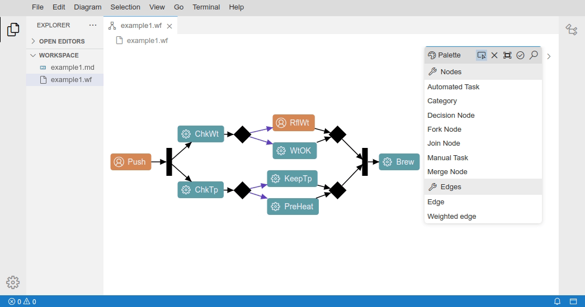
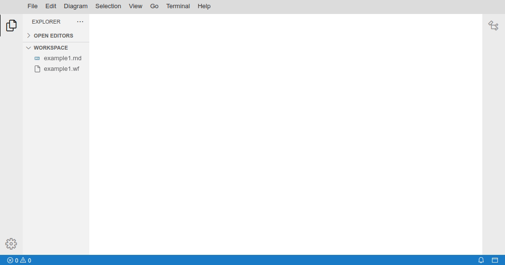

+++
fragment = "content"
weight = 100

title = "UI Extensions"

[sidebar]
  sticky = true
+++

A UI Extension is a concept provided by the underlying framework Sprotty, which allows to display additional UI HTML elements on top of a diagram.

It is often used to add UI controls to the diagram. It is also frequently used in the core GLSP functionality:

- the GLSP [tool palette](https://github.com/eclipse-glsp/glsp-client/blob/master/packages/protocol/src/action-protocol/tool-palette.ts)
- the Sprotty [command palette](https://github.com/eclipse/sprotty/blob/master/packages/sprotty/src/features/command-palette/command-palette.ts)
- the Sprotty [EditLabelUI](https://github.com/eclipse/sprotty/blob/master/packages/sprotty/src/features/edit/edit-label-ui.ts)

### Register and activate custom UI Extensions

To implement a custom UI extension, it is necessary to extend the base [`AbstractUIExtension`](https://github.com/eclipse/sprotty/blob/master/packages/sprotty/src/base/ui-extensions/ui-extension.ts).
This super class provides a base HTML element (`containerElement`) which is then the base for the custom UI elements.
It also provides utility methods for showing/hiding or handling focus of the extension.
To add the actual UI elements to the DOM, the abstract method `initializeContents` must be implemented.

[uiex-registry]: https://github.com/eclipse/sprotty/blob/master/packages/sprotty/src/base/ui-extensions/ui-extension-registry.ts

The [UIExtensionRegistry][uiex-registry] allows to register multiple UIExtensions per diagram.

To enable a UI Extension a [`SetUIExtensionVisibilityAction`][uiex-registry] or [`SetUIExtensionVisibilityCommand`][uiex-registry] with the respective UI Extension ID needs to be invoked.

As already mentioned, there is a broad use case for UI extensions, hence also their trigger events can of course vary.
UI extensions can be enabled practically with any event that can dispatch an action, e.g. via context menu entries, mouse click events, keyboard events or changes of the diagram itself, for example the change of the diagram's `EditMode`.

For example:

- The GLSP `ToolPalette` is opened via the GLSP Action `EnableToolPalette` right after the model was requested in [GLSPDiagramWidget#`dispatchInitialActions()`](https://github.com/eclipse-glsp/glsp-theia-integration/blob/master/packages/theia-integration/src/browser/diagram/glsp-diagram-widget.ts).
- The `CommandPalette` is opened via the keyboard shortcut <kbd>Ctrl</kbd>+<kbd>Space</kbd>.
- The `EditLabelUI` is opened via a double click on an editable Label (e.g. a Category or Task node in the Workflow example).
- The `TaskEditor` in the Workflow example is opened via a context menu entry (`Direct Edit Task`) for the Task node.

The following GIF shows the different triggers of the the mentioned extensions:



### Button Overlay Showcase

The following section gives an overview of the necessary bits to create a very simple UI Extension that provides two buttons to center a diagram or fit it to the screen.
This showcase is implemented on top of the Workflow example in the `glsp-client` and `glsp-theia-integration`.

At first, the UI extension needs to be defined, in this case we want the provided base HTML element (`containerElement`) to contain our buttons.
Those buttons should show an icon as well as a descriptive text label and should trigger the respective GLSP Action on click of either one of them.
Therefore we create for each button a `<div>` which contains the icon `<i>` and the description as adjacent text.

```ts
@injectable()
export class ButtonOverlay extends AbstractUIExtension {
  @inject(TYPES.IActionDispatcher)
  protected readonly actionDispatcher: IActionDispatcher;

  static readonly ID = "button-overlay";

  id() {
    return ButtonOverlay.ID;
  }

  containerClass() {
    return ButtonOverlay.ID;
  }

  protected initializeContents(containerElement: HTMLElement): void {
    containerElement.appendChild(
      this.createButton(
        "btn_center_diagram",
        "Center",
        "screen-normal",
        CenterAction.create([])
      )
    );
    containerElement.appendChild(
      this.createButton(
        "btn_fit_diagram",
        "Fit to screen",
        "screen-full",
        FitToScreenAction.create([])
      )
    );
  }

  protected createButton(
    id: string,
    label: string,
    codiconId: string,
    action: Action
  ): HTMLElement {
    const baseDiv = document.getElementById(this.options.baseDiv);
    if (baseDiv) {
      const button = document.createElement("div");
      const insertedDiv = baseDiv.insertBefore(button, baseDiv.firstChild);
      button.id = id;
      button.classList.add("overlay-button");
      const icon = this.createIcon(codiconId);
      insertedDiv.appendChild(icon);
      insertedDiv.onclick = () => this.actionDispatcher.dispatch(action);
      insertedDiv.insertAdjacentText("beforeend", label);
      return button;
    }
    return document.createElement("div");
  }

  protected createIcon(codiconId: string): HTMLElement {
    const icon = document.createElement("i");
    icon.classList.add(...codiconCSSClasses(codiconId), "overlay-icon");
    return icon;
  }
}
```

To improve the styling of the extension, we make use of the defined CSS classes and position the overlay on the top left of the diagram and reduce the opacity of the buttons by default.
On hover, the buttons are fully visible.

```css
.button-overlay {
  position: absolute;
  left: 25px;
  top: 25px;
  text-align: left;
  min-width: 150px;
  display: flex;
  flex-direction: column;
  z-index: 1000;
  font-family: sans-serif;
}

.overlay-button {
  opacity: 0.5;
  display: flex;
}

.overlay-button:hover {
  opacity: 1;
  cursor: pointer;
}

.overlay-icon {
  margin-right: 10px;
  padding-left: 5px;
  width: 16px;
  height: 16px;
  text-align: center;
}
```

To register the extension, it has to be bound as singleton and

```ts
bind(ButtonOverlay).toSelf().inSingletonScope();
bind(TYPES.IUIExtension).toService(ButtonOverlay);
```

To activate our UI extension, for example, alongside the initial actions, we can dispatch the `SetUIExtensionVisibilityAction` in [GLSPDiagramWidget#`dispatchInitialActions()`](https://github.com/eclipse-glsp/glsp-theia-integration/blob/master/packages/theia-integration/src/browser/diagram/glsp-diagram-widget.ts) after a certain delay.

```ts
export class MyGLSPDiagramWidget extends GLSPDiagramWidget {
    ...
    protected async dispatchInitialActions(): Promise<void> {
        super.dispatchInitialActions();
        this.actionDispatcher.onceModelInitialized().then(() =>
            this.actionDispatcher.dispatch(SetUIExtensionVisibilityAction.create({ extensionId: "button-overlay", visible: true }))
        );
    }
}
```

The outcome of this showcase is the following subtle UI overlay that offers to center the diagram or fit it to the screen:


