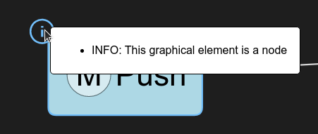
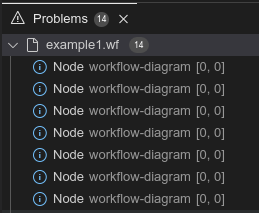

+++
fragment = "content"
weight = 100

title = "Model Validation"

[sidebar]
  sticky = true
+++

Validation rules for the source and/or graphical model are typically implemented on the GLSP server, as only the server has the full knowledge of the underlying model.
Model validation rules are by nature specific to the underlying modeling language and therefore have to be provided by the specific server implementation.
The interface to be implemented is called `ModelValidator`. The `ModelValidator` is invoked for a set of model elements and creates issue markers for them.

In many scenarios, the ModelValidator implementation delegates to another component, such as EMF validation, etc.

Let's have a look at a simple example implementation of a model validator:

<details open><summary>Java Server</summary>

```java
public class CustomModelValidator implements ModelValidator {

   @Override
   public List<Marker> validate(final GModelElement... elements) {
      List<Marker> markers = new ArrayList<>();
      for (GModelElement element : elements) {
         if (element instanceof GNode) {
            markers.add(validateGNode((GNode) element));
         }
         element.getChildren().forEach(child -> markers.addAll(validate(child)));
      }
      return markers;
   }

   protected Marker validateGNode(final GNode element) {
      return new Marker("Node", "This graphical element is a node", element.getId(),
       MarkerKind.INFO);
   }

}
```

</details>

<details><summary>Node Server</summary>

```ts
@injectable()
export class CustomModelValidator implements ModelValidator {
    @inject(GModelState)
    protected readonly modelState: GModelState;

    validate(elements: GModelElement[]): Marker[] {
        const markers: Marker[] = [];
        for (const element of elements) {
            if (element instanceof GNode) {
                markers.push(this.validateGNode(element));
            }
            if (element.children) {
                markers.push(...this.validate(element.children));
            }
        }
        return markers;
    }

    protected validateGNode(element: GNode): Marker {
        return {
            kind: MarkerKind.INFO,
            description: 'This graphical element is a node',
            elementId: element.id,
            label: 'Node'
        };
    }
}
```

</details>
</br>

This validator iterates over the given model elements and their children and creates a new info marker for each element that is an instance of GNode.
An issue marker is associated with a graphical element via its “id”.
In addition, the marker has a label, an issue description and a kind indicating its severity.
The severity can either be “INFO”,”WARN” or “ERROR”.
The created markers are then propagated to the client via a [SetMarkersAction](https://github.com/eclipse-glsp/glsp/blob/master/PROTOCOL.md#2102-setmarkersaction).

To enable the custom model validator, it has to be bound in the diagram module.

<details open><summary>Java Server</summary>

```java
@Override
protected Class<? extends ModelValidator> bindModelValidator() {
    return CustomModelValidator.class;
}
```

</details>

<details><summary>Node Server</summary>

```ts
protected override bindModelValidator(): BindingTarget<ModelValidator> | undefined {
    return CustomModelValidator;
}
```

</details>
</br>

Validation is typically triggered by the client via a [RequestMarkersAction](https://github.com/eclipse-glsp/glsp/blob/master/PROTOCOL.md#2101-requestmarkersaction) – e.g., by clicking the validation button in the tool palette. 
In addition, the server can also send a [SetMarkersAction](https://github.com/eclipse-glsp/glsp/blob/master/PROTOCOL.md#2102-setmarkersaction) to the client without a preceding request at any time.
This is useful to implement features such as automatic live validation after each model update.

The client visualizes each marker by decorating the corresponding graphical element with an icon indicating the severity.
 When hovering over the issue marker a tooltip with the issue description is displayed.


<br>
<br>


Depending on the chosen platform integration, validation markers are propagated to other user interface components.
For instance, when integrating GLSP into Theia, markers are also translated into items shown in the Problems view.


